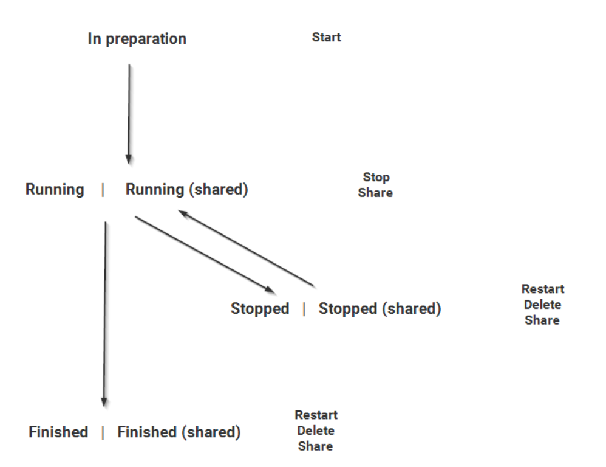

# Overview

This is repository collects some test plans that I generated for project and work

 

1. **Project-01: generate a test plan for a computation system panel**
- The requirements are followings:
    - In the application there is a tab dedicated to computations. Here you can create new computations or see and manage existing ones. The computations and their results are stored on the database and should remain until they are manually deleted. Restarting client or server must have no impact on the existing computations.
    - There are five different types of computations which can be executed for various data sets:
        - Monitoring
        - Level
        - Matching
        - Design
        - Simulation
    - Each type can be fed with various data and settings which can be disregarded for the test. To create a computation, there is a panel with buttons for each type.
    - To start a computation, you need to enter a name, a data set and a solution. The data set and solutions are defined somewhere else and it can be assumed that there are valid and invalid examples for them. You can optionally set a start and end date and activate an .xml export.
    - There is a panel with possible actions. Actions which are not available must be disabled. A computation can be:
        - Started
        - Stopped
        - Restarted
        - Deleted
        - Shared (with other users)
        
        - The possible transitions and actions are seen in the following image: 
         
        

         

        - A running computation will show the current progress.

        - If a computation fails (for example because of invalid data), a simple warning is shown in the client and in the computation log a detailed error message can be found.
        - Additionally, for each finished or stopped computation which belongs to or has been shared with a user, the user can:
            - Look at the used data set
            - Look at the used solution
            - Show the computation logs
        - To have a better overview on the listed computations, there is a filter panel.It allows to filter by creation date (from and to), name, used data set, owned computations, shared computations and each computation type.
        - Changes in the filter are only applied, once the Update button is clicked.
        - An administrator can set for each user role whether it is possible to see or create computations and manage computations of other users.
        - panel is as following:
         
        
         
        - log is as following:
         
        

- Some tes cases example in test plan are as followings, the full test plan is located in folder [project-01/test_plan.pdf](https://github.com/quereinsteigerin/myTestplanCollection/blob/main/project-01/img/test_plan.pdf)
 

2. **Project-02: generate a test plan for a banking system**
- The Banking projects ....
    - xxx
    - xxdax
      
     

     Some tes cases example in test plan are as followings, the full test plan is located in folder [project-02/banking.pdf](https://github.com/quereinsteigerin/myTestplanCollection/blob/main/project-02/img/banking.pdf)

